# Azure Deployment Architecture

Summary of resources, what they are and why they are used:

- Azure Container Registry (ACR)
  - What: Private container image registry hosted in Azure.
  - Why: Hold built container images built by CI (GitHub Actions) so AKS can pull them. `.azure/modules/acr.bicep` and `.azure/modules/acr-role-assignment.bicep` create and give AKS permission to pull.

- Azure Kubernetes Service (AKS)
  - What: Managed Kubernetes offering.
  - Why: Run the application as pods, provide autoscaling, integrations (managed identity, AAD, networking). `.azure/modules/aks.bicep` and `.azure/modules/aks-rbac-assignment.bicep` define the cluster and RBAC glue.

- Azure Key Vault
  - What: Centralized secret and key management.
  - Why: Store sensitive configuration (DB passwords, API keys). The Secrets Store CSI Driver (and `.azure/k8s/secret-provider-class.yml`) mounts Key Vault secrets into pods so apps don't store secrets in plain text. Provisioned via `.azure/modules/keyvault.bicep` with RBAC via `.azure/modules/keyvault-role-assignment.bicep`.

- Networking (VNet, subnets, DNS)
  - What: Virtual network with subnets for AKS and Cosmos DB for PostgreSQL; private DNS zone link and public DNS zone (optional delegated child zone).
  - Why: Provide network isolation and private connectivity for data layer; expose public DNS for ingress. See `.azure/modules/networking.bicep`.

- Managed Identities
  - What: Azure-managed identities (system or user-assigned) for resources.
  - Why: Allow AKS (and other services) to authenticate to Key Vault and other Azure resources without credentials in code. Configured in `.azure/base/identity.bicep` / `.azure/base/admin-identity.bicep`.

- Cert-Manager + Let's Encrypt
  - What: Kubernetes controller for automated TLS certificate management.
  - Why: Issue and renew TLS certificates automatically for ingress hostnames. Configs live in `.azure/k8s/cert-manager` (issuers for staging/prod).

- Ingress Controller & Public IP / DNS
  - What: The ingress controller (e.g., nginx/Traefik deployed by manifests) plus a public IP and a DNS label.
  - Why: Terminate TLS, route external HTTP(s) traffic into the cluster to services and pods. DNS label / public IP resources are provisioned by `.azure/modules/ingress-dnslabel.bicep`; public DNS zone (and optional child zone) is set up in `.azure/modules/networking.bicep`.

- Datastores: Azure Cosmos DB for PostgreSQL (Citus)
  - What: Managed distributed PostgreSQL service.
  - Why: Persist application data with private endpoints and private DNS. `.azure/modules/cosmosdb-postgresql.bicep` provisions the cluster and its private networking.

- GitHub Actions OIDC and CI/CD
  - What: OIDC integration allows GitHub Actions to request short-lived tokens to authenticate to Azure.
  - Why: Securely push images to ACR and deploy infrastructure/manifests without storing long-lived Azure credentials. See `.azure/modules/gha-oidc-identity.bicep` in the repo.

How internet traffic is served (request flow)

1. A client/browser resolves the application hostname via DNS to the public IP provisioned for the ingress.
2. The request reaches Azure's public IP and is forwarded to AKS's Load Balancer (Service of type LoadBalancer) and then to the Ingress Controller.
3. The Ingress Controller matches the host/path and routes to the appropriate Service and backend Pod.
4. TLS is terminated at the Ingress Controller using certificates issued and renewed by cert-manager (which uses Let's Encrypt). Secrets for TLS or other credentials can be sourced from Key Vault via CSI.
5. Pods may connect to Cosmos DB or PostgreSQL using credentials retrieved from Key Vault or from environment/config maps.

Notes and pointers:

- This architecture emphasizes: managed services (AKS, ACR, Key Vault, managed DBs), least-privilege access (managed identities, role assignments), and automated cert management.

Relevant files in this repo (under `.azure`)
- `.azure/modules/*` (Bicep modules provisioning networking/VNet & DNS, ACR, AKS, Key Vault, Cosmos DB for PostgreSQL, ingress DNS label, and RBAC assignments)
- `.azure/base/*` (managed identities)
- `.azure/k8s/*` (Kubernetes manifests: `deployment.yml`, `service.yml`, `headless-service.yml`, `ingress.yml`, `secret-provider-class.yml`, `cert-manager/*`)
- `.azure/scripts/*` (helper deployment scripts)

